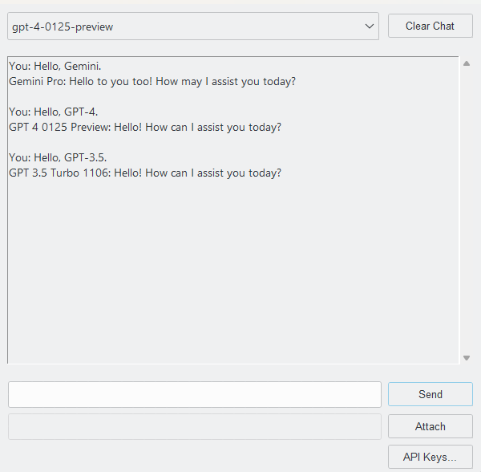

# AI Chatbot
An open-source Python GUI application built using the Tkinter library. It offers users an interface to interact with text and vision AI models from both OpenAI and Google.

## Screenshots


## Features
* Interact with the AI models through an easy-to-use GUI
* Choose between different Gemini, GPT-4, and GPT-3.5 text or vision models
* Supports both text and image inputs for generating responses
* Input and manage your API keys for accessing the AI models
* View your message history with the ability to clear all messages

## Dependencies
* pathlib
* base64
* tkinter
* ttkthemes
* keyboard
* google.generativeai
* openai
  
## Installation
**1. Clone the repository**
```bash
git clone https://github.com/PouyaMT/ai-chatbot.git
```

**2. Install the dependencies**
```bash
pip install -r requirements.txt
```

**3. Run the script**
```bash
python main.py
```
